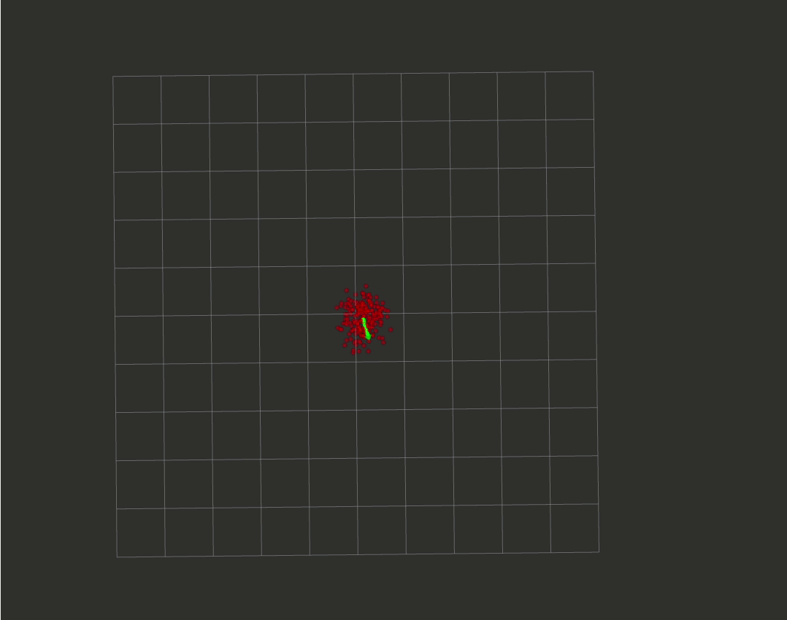
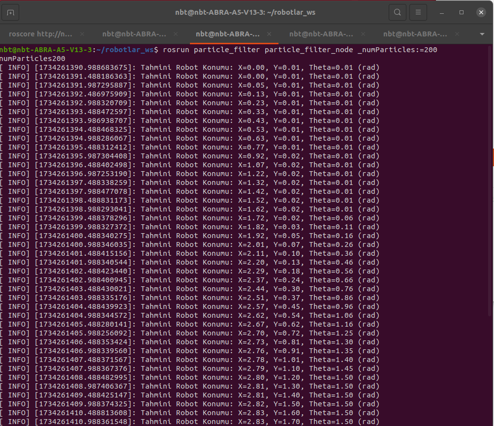
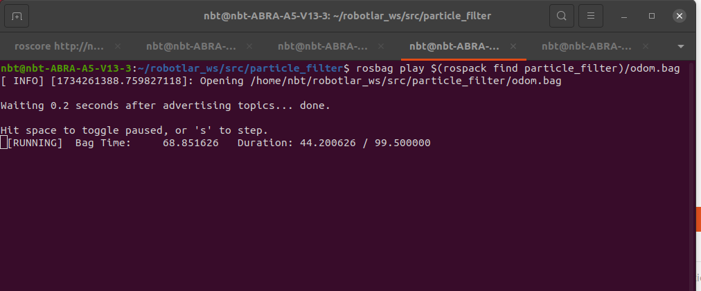
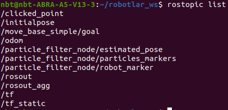

# Particle Filter 
Bu proje, ROS tabanlı bir Particle Filter Localization uygulamasıdır. Amaç, bir robotun odometri verilerini kullanarak tahmini konumunu belirlemek ve bu tahmini konumu parçacıkların (particles) dağılımı üzerinden elde etmektir. Bu algoritma, odometri verilerinin gürültü içeren yapısını modellemek için Üçgen Dağılım Gürültü Modeli kullanmaktadır.

## Kurulum 
- Particle filter node'unu derlemek için:
```
$ cd ~/yourpath/src
$ git clone https://gitlab.com/blm6191_2425b/members/23501021/blm6191-robotlar-odev-3.git
$ cd ~/yourpath
$ catkin_make
$ source ~/.bashrc
```

- Particle filter node'unu başlatmak için:
```
[CTRL+ALT+T]
$ roscore
[CTRL+SHIFT+T]
$ rosrun particle_filter particle_filter_node _numParticles:=200
[CTRL+SHIFT+T]
$ rviz
```

- odom.bag Dosyası
```
$ rosbag play $(rospack find particle_filter)/odom.bag
```

### Çalışma Prensibi
- Parçacıklar robotun başlangıç pozisyonu etrafında rastgele dağıtılır.
- Gelen odometri mesajına göre parçacıklar, gürültü eklenmiş kontrol işaretleri kullanılarak güncellenir.
- Parçacıkların güncel konumlarının ortalaması alınarak robotun tahmini konumu elde edilir. Aynı zamanda tahmin edilen robotun konumu yayınlanır.
- Parçacıkların ve tahmini robot konumunun görsel temsili RViz'de gösterilir.


### Kullanılan Topic'ler
- /odom : Odometri verisi (tip: nav_msgs::Odometry)
- particles_markers : Parçacıkların RViz'de gösterilmesi için MarkerArray
- robot_marker : Robotun tahmini konumunu gösteren Marker
- estimated_pose : Tahmini konumun Pose2D mesajı olarak yayınlanması

Robotun hareketini ve parçacıkların dağılımını  bu sayede gözlemleyebilirsiniz.


#### Sonuç
Parçacık Filtresi (Particle Filter) algoritması uygulanarak robotun gürültülü odometri verisi ile tahmini konumunu hesaplanır ve RViz üzerinden görselleştirilir. Parçacıkların güncellenmesi ve ortalama konum hesabı ile tahmin edilen konum sürekli olarak iyileştirilir.

- Rotobun Tahmin Edilen Hareket Sonucu Görselleştirilmesi
<p>

</p>

- RVIZ Başlangıç Görüntüsü
<p>

</p>

- Ros Node Çıktısı
<p>

</p>

- Odom.bag Çıktısı
<p>

</p>

- rostopic list
<p>

</p>

