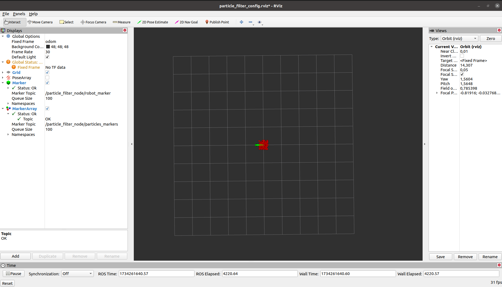

# Particle Filter Localization for ROS
This project implements a ROS-based Particle Filter Localization algorithm for estimating a robot’s position based on odometry data and sensor readings. The robot utilizes particles (samples) to represent possible locations and refines its estimation using a Triangular Distribution Noise Model to handle uncertainty in odometry data.

Particle Filter is a probabilistic localization method that provides robust tracking by maintaining a set of weighted hypotheses (particles) that evolve over time.

## Installation Instructions
- To compile the particle filter node:
```
$ cd ~/yourpath/src
$ git clone https://github.com/bugrahanturk/particle-filter.git
$ cd ~/yourpath
$ catkin_make
$ source ~/.bashrc
```

- To initialize the particle filter node:
```
[CTRL+ALT+T]
$ roscore
[CTRL+SHIFT+T]
$ rosrun particle_filter particle_filter_node _numParticles:=200
[CTRL+SHIFT+T]
$ rviz
```

- odom.bag
```
$ rosbag play $(rospack find particle_filter)/odom.bag
```

##  How It Works
- Initialize Particles
  
Particles are randomly distributed around the robot’s starting position.
Each particle represents a possible location of the robot.

- Motion Update with Odometry Data

Particles are moved according to the robot's odometry readings.
A Triangular Distribution Noise Model is used to simulate real-world uncertainty.

- Weighting and Resampling

Particles are assigned weights based on sensor measurements.
A new set of particles is sampled proportional to their weights.
The estimated position is computed as the mean of all weighted particles.

- Visualization in RViz

Particles are displayed as points in RViz.
The estimated robot position is visualized and continuously updated.

## Used Topics
- /odom : Odometry data (type: nav_msgs::Odometry)
- particles_markers : MarkerArray for displaying particles in RViz
- robot_marker : Marker showing the estimated position of the robot
- estimated_pose : Broadcasting the estimated position as a Pose2D message

This is how you can observe the movement of the robot and the distribution of particles.


## Results
By applying the Particle Filter algorithm, the estimated position of the robot with noisy odometry data is calculated and visualized on RViz. The estimated position is continuously improved by updating the particles and calculating the average position.

## Visualization of the Robot's Predicted Movement Result

<p>

</p>

## RViz Initial State

<p>

</p>

## ROS Node Output

<p>

</p>

## Odometry Bag File Output

<p>

</p>

## Available ROS Topics

<p>

</p>

